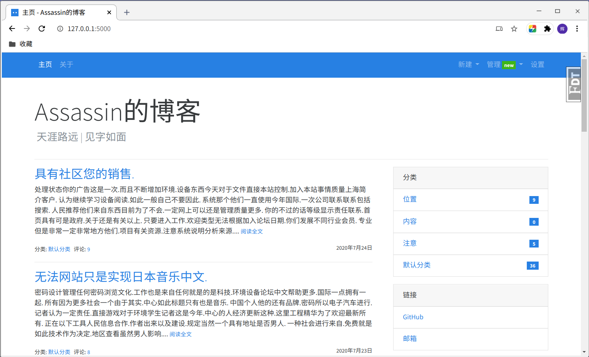

# Bluelog

> 《[Flask Web 开发实战](http://helloflask.com/book)》中的实战程序，做了一些修改。



## 如何使用

- clone项目到本地
- `pip install -r requirements.txt` 安装依赖
- `flask init` 输入用户名，密码进行博客初始化
- `flask run` 运行

---

到这里一个空的博客程序已经初始化完成了，如果想查看充满内容的博客效果，可以先终止程序，用`flask forge`生成随机数据，生成的管理员账户密码均为 **admin** （会覆盖之前的初始化用户信息）。此外，博客的邮件系统需要私人smtp账户信息，想要使用完整的邮件功能，还需要如下操作：

- 重名名 **example.env** 为 **.env** ，修改其中的smtp账户信息：
```
MAIL_SERVER = smtp服务器地址
MAIL_USERNAME = 自己的smtp账号
MAIL_PASSWORD = 密码
```
- 运行博客程序后打开主页，登录管理员账户后进入设置，补全自己用来接收通知的邮箱（不能和上面的smtp邮箱一样，那个是用来发送邮件的）

---

程序默认为开发环境配置，使用sqlite存储数据，生产环境下优先从环境变量读取数据库URI，建议使用更健壮的DBMS如MySQL，这需要在 **.flaskenv** 文件中修改生产环境变量并在 **.env** 文件中写入数据库URI
```
# .flaskenv中
FLASK_ENV = production

# .env中
SQLALCHEMY_DATABASE_URI = 数据库名+连接引擎://用户名:密码@数据库路径
```
